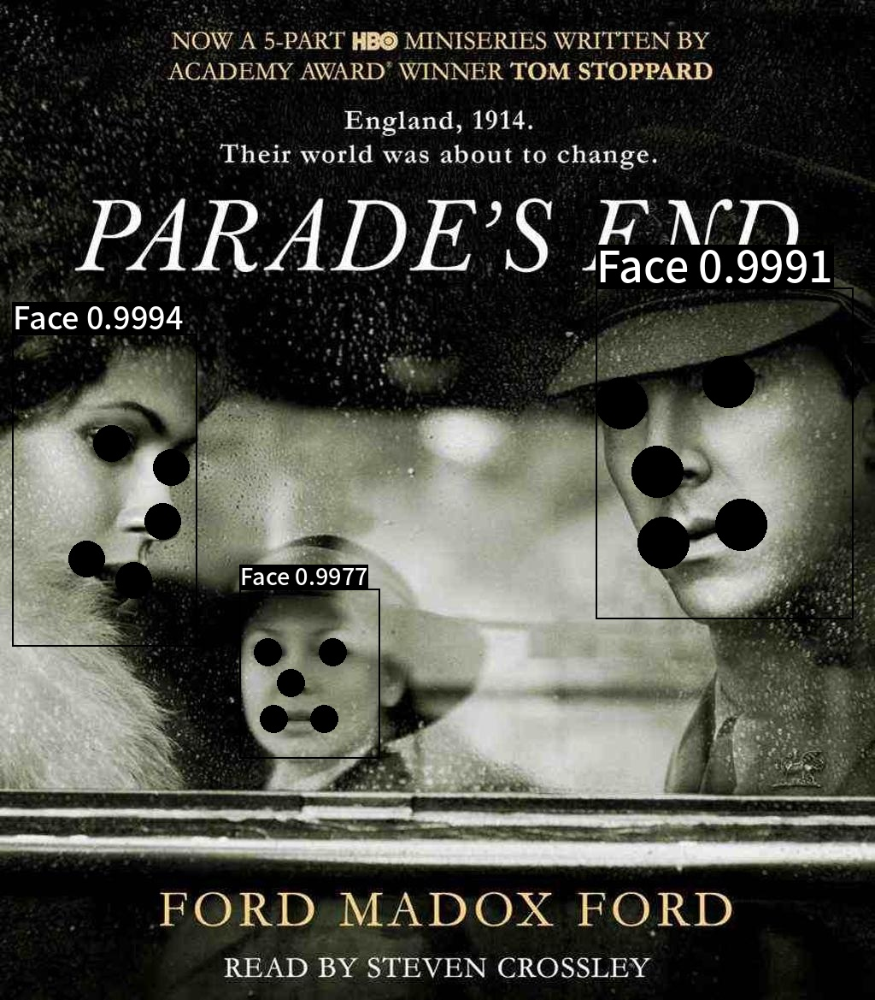
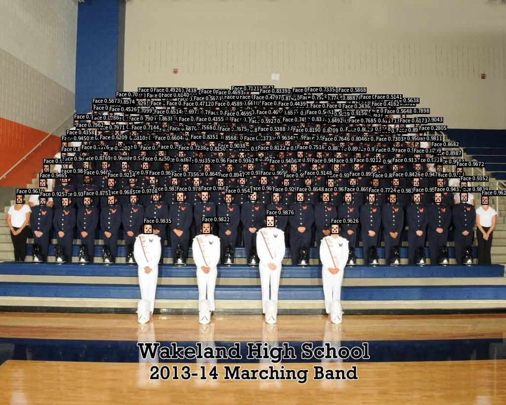

# faces_detanator

<a href="https://www.python.org/"></a>

High accurate tool for automatic faces detection with landmarks.

The library is based on public detectors with high accuracy (TinaFace, Retinaface, SCRFD, ...). All models predict detections, then voting algorithm performs aggregation.

| | | |
|:-------------------------:|:-------------------------:| :-------------------------:|
|  |   |  |

## Prerequisites

1) [Install Docker](https://docs.docker.com/engine/install/ubuntu/)
2) [Install Nvidia Docker Container Runtime](https://docs.nvidia.com/datacenter/cloud-native/container-toolkit/install-guide.html#docker)
3) Install **nvidia-container-runtime**: `apt-get install nvidia-container-runtime`
4) Set `"default-runtime" : "nvidia"` in `/etc/docker/daemon.json`:
    ```json
    {
        "default-runtime": "nvidia",
        "runtimes": {
            "nvidia": {
                "path": "nvidia-container-runtime",
                "runtimeArgs": []
            }
        }
    }
    ```
5) Restart Docker: `systemctl restart docker`
5) Install **git-lfs** to pull artifacts: `git lfs install` 


## 🚀&nbsp;&nbsp;Quickstart
```yaml
# clone project
https://github.com/IgorHoholko/faces_detanator

# [OPTIONAL] create virtual enviroment
virtualenv venv --python=python3.7
source venv/bin/activate

# install requirements
pip install -r requirements.txt
```

## Annotate your images
To start annotating, run the command:
```bash
python run.py -i <path_to_your_images>
```
For more information run:
```bash
python run.py -h
```


